# シフト自動化システム エンジニア向け引継ぎ書

## 1. システム概要

### RPAツールの名称とバージョン
- **ツール名**: シフト自動化システム (unsta_shift_app)
- **プラットフォーム**: Google Apps Script (GAS)
- **ランタイムバージョン**: V8
- **現在のバージョン**: 1.0
- **ベースシステム**: gannt_chart_app の改良版

### 導入の背景と目的
- **背景**: 手動でのシフト表作成とメンバー情報管理の効率化が必要
- **目的**: 
  - シフト表作成業務の自動化
  - メンバー情報の一元管理と同期
  - 部署別ガントチャートの自動生成
  - 人的ミスの削減と作業時間短縮

### 対象業務の説明
- **シフト表作成業務**: 時間軸設定と行複製による効率的なシフト表生成
- **メンバー情報管理業務**: メンバーデータの一括更新と複数シートへの同期
- **ガントチャート作成業務**: 部署別ガントチャートの自動生成
- **データ入力業務**: カスタムポップアップによる直感的なデータ入力

## 2. システム構成

### ハードウェア構成
- **実行環境**: Google Cloud Platform (GCP)
- **必要なクライアント環境**: Webブラウザが動作するPC/デバイス
- **推奨スペック**: メモリ4GB以上、画面解像度1024×768以上

### ソフトウェア構成
- **プラットフォーム**: Google Apps Script (GAS)
- **ランタイム**: V8 JavaScript Engine
- **タイムゾーン**: Asia/Tokyo
- **使用技術**:
  - Google Apps Script V8 Runtime
  - Google Spreadsheet API
  - Google Cache Service
  - HTML Service (カスタムポップアップ)
  - Properties Service (設定管理)

### ネットワーク構成
- **インターネット接続**: 必須
- **Google Workspace**: 認証・認可基盤
- **外部API**: Google Spreadsheet API、Google Drive API
- **セキュリティ**: OAuth 2.0認証、HTTPS通信

### 外部連携システムの概要
- **Google Spreadsheet**: データ保存・表示基盤
- **Google Drive**: ファイル管理・共有
- **Google Cache Service**: 一時データ保存
- **Google Properties Service**: 設定値管理

### システム構成図
```
┌─────────────────────────────────────────┐
│           Google Spreadsheet            │
│  ┌─────────────────────────────────────┐ │
│  │        Container Spreadsheet        │ │
│  │  - メンバーデータシート              │ │
│  │  - 設定情報                         │ │
│  └─────────────────────────────────────┘ │
└─────────────────────────────────────────┘
                    │
                    ▼
┌─────────────────────────────────────────┐
│         Google Apps Script              │
│  ┌─────────────────────────────────────┐ │
│  │           Controller Layer          │ │
│  │  - 3000_controller_menu.js          │ │
│  │  - 3100_controller_popupDialog.js   │ │
│  └─────────────────────────────────────┘ │
│  ┌─────────────────────────────────────┐ │
│  │            Service Layer            │ │
│  │  - 2000_service_memberDataUpdater   │ │
│  │  - 2100_service_shiftDataMerger     │ │
│  │  - 2101_service_shiftDataRetriever  │ │
│  │  - 2102_service_shiftDataTransformer│ │
│  │  - 2103_service_shiftDataMapper     │ │
│  │  - 2199_service_columnManager       │ │
│  └─────────────────────────────────────┘ │
│  ┌─────────────────────────────────────┐ │
│  │           Template Layer            │ │
│  │  - 1000_template_ganttBuilder       │ │
│  │  - 1100_template_ganttCloneWithMD   │ │
│  └─────────────────────────────────────┘ │
│  ┌─────────────────────────────────────┐ │
│  │            Library Layer            │ │
│  │  - 9800_lib_copyMemberData          │ │
│  │  - 9900_lib_cellMerger              │ │
│  └─────────────────────────────────────┘ │
└─────────────────────────────────────────┘
                    │
                    ▼
┌─────────────────────────────────────────┐
│         Target Spreadsheet              │
│  ┌─────────────────────────────────────┐ │
│  │        Gantt Chart Sheets           │ │
│  │  - 複数のガントチャートシート        │ │
│  │  - メンバーリストシート              │ │
│  └─────────────────────────────────────┘ │
└─────────────────────────────────────────┘
```

## 3. 業務フロー

### 業務プロセスの全体像
1. **メンバー情報管理**: 「メンバー情報」シートでマスターデータを管理
2. **ガントチャート作成**: 部署別にガントチャートシートを自動生成
3. **シフト表作成**: 時間軸設定と行複製でシフト表を効率的に作成
4. **データ同期**: メンバー情報の変更を全シートに一括反映

### RPAが関与する部分の詳細
- **自動化対象**:
  - 時間軸の自動生成（開始時刻〜終了時刻、指定間隔）
  - 行の書式付き複製（指定回数）
  - 部署別ガントチャートシートの自動作成
  - メンバー情報の全シート一括更新
- **手動作業**:
  - メンバー情報の初期入力・更新
  - ガントチャートテンプレートの設計
  - 業務スケジュールの入力

### 前後の業務との関係
- **前工程**: メンバー情報の収集・整理
- **後工程**: 作成されたシフト表・ガントチャートの確認・配布
- **関連システム**: 人事システム（メンバー情報の元データ）

### シナリオの一覧と目的

#### シナリオ1: FMシート作成
- **目的**: シフト表の基本構造を効率的に作成
- **処理内容**: 
  - 時間軸の自動生成
  - 行セットの書式付き複製

#### シナリオ2: ガントチャート作成
- **目的**: 部署別ガントチャートの自動生成
- **処理内容**:
  - メンバー情報の部署別グループ化
  - ガントチャートテンプレートの複製
  - メンバーデータの統合

#### シナリオ3: メンバー情報更新
- **目的**: マスターデータの全シート同期
- **処理内容**:
  - メンバー情報の取得
  - 全ガントチャートシートの更新

### 各シナリオの処理内容

#### シナリオ1詳細: FMシート作成
```javascript
// 時間軸設定の処理フロー
1. ユーザーがセル範囲を選択
2. setTimescale() 関数実行
3. カスタムダイアログで時間設定入力
4. buildTimescaleArray() で時間配列生成
5. スプレッドシートに時間軸を挿入

// 行複製の処理フロー
1. ユーザーが複製対象行を選択
2. duplicateRows() 関数実行
3. 複製回数をダイアログで入力
4. duplicateSelectedRowsWithFormatting() で書式付き複製
```

#### シナリオ2詳細: ガントチャート作成
```javascript
// ガントチャート作成の処理フロー
1. promptUserForGanttChartInfo() でパラメータ取得
2. getMemberDataAndHeaders() でメンバー情報取得
3. groupMemberDataByDept() で部署別グループ化
4. createDeptSheet() で部署別シート作成
5. prepareGanttData() でガントデータ準備
6. メンバーデータをガントチャートに統合
```

#### シナリオ3詳細: メンバー情報更新
```javascript
// メンバー情報更新の処理フロー
1. updateMemberDataInGanttCharts() 実行
2. スクリプトプロパティから設定取得
3. getMemberDataAndHeaders() でマスターデータ取得
4. createMemberDataMap() でデータマップ作成
5. updateGanttSheet() で各シート更新
```

### 使用している変数や引数の説明

#### 共通定数
```javascript
const COL_HEADER_NAMES = {
  DEPT: "dept",                    // 部署名
  EMAIL: "email",                  // メールアドレス
  MEMBER_ID: "memberId",           // メンバーID
  MEMBER_DATE_ID: "memberDateId",  // メンバー日付ID
  DATE: "date"                     // 日付
};

const REQUIRED_MEMBER_DATA_HEADERS = {
  DATA_SHEET: {
    INITIALIZE: ["dept", "email"],
    UPDATE: ["dept", "email", "memberId"]
  },
  GANTT_SHEETS: {
    INITIALIZE: ["memberDateId", "date"],
    UPDATE: ["memberDateId"]
  }
};
```

#### 主要変数
- **memberDataMap**: メンバーIDをキーとしたメンバー情報のマップ
- **ganttHeaders**: ガントチャートのヘッダー配列
- **commonHeaders**: メンバー情報とガントチャートの共通ヘッダー
- **headerIndices**: ヘッダーのインデックス情報
- **daysPerMember**: 一人あたりの日数設定

### エラー処理の実装方法

#### 基本的なエラーハンドリング
```javascript
try {
  // 処理実行
  const result = someFunction();
  return result;
} catch (error) {
  console.error("エラー詳細:", error);
  SpreadsheetApp.getUi().alert("エラー: " + error.message);
  return false;
}
```

#### バリデーション処理
```javascript
// ヘッダー検証
function validateHeaders(headers, requiredHeaders) {
  const missingHeaders = requiredHeaders.filter(
    required => !headers.includes(required)
  );
  
  if (missingHeaders.length > 0) {
    throw new Error(`必須ヘッダーが見つかりません: ${missingHeaders.join(', ')}`);
  }
  
  return true;
}
```

## 5. 運用手順

### 定期的なメンテナンス作業

#### 日次作業
- 実行ログの確認
- エラー発生状況の監視
- ユーザーからの問い合わせ対応

#### 週次作業
- パフォーマンス指標の確認
- スクリプトプロパティの確認
- 期限切れダイアログプロパティのクリーンアップ

#### 月次作業
- スプレッドシートのバックアップ
- 使用状況レポートの作成
- システム設定の見直し

### ログの確認方法

#### Google Apps Scriptログ
```javascript
// ログ出力方法
console.log("デバッグ情報");
Logger.log("従来のログ");

// ログ確認手順
1. Google Apps Scriptエディタを開く
2. 「実行」→「実行ログを表示」
3. エラーや警告メッセージを確認
```

#### 実行履歴の確認
1. GASエディタの「実行数」タブを確認
2. 実行時間とエラー発生状況を監視
3. 異常な実行時間やエラー率を検知

### バックアップとリストアの手順

#### スプレッドシートバックアップ
```javascript
// 自動バックアップスクリプト（例）
function backupSpreadsheet() {
  const ss = SpreadsheetApp.getActiveSpreadsheet();
  const backupName = `${ss.getName()}_backup_${new Date().toISOString().split('T')[0]}`;
  const backup = ss.copy(backupName);
  
  // バックアップフォルダに移動
  const backupFolder = DriveApp.getFolderById('BACKUP_FOLDER_ID');
  DriveApp.getFileById(backup.getId()).moveTo(backupFolder);
}
```

#### スクリプトプロパティバックアップ
```javascript
// プロパティバックアップ
function backupScriptProperties() {
  const props = PropertiesService.getScriptProperties();
  const allProps = props.getProperties();
  
  // JSON形式でログ出力
  console.log("Script Properties Backup:", JSON.stringify(allProps, null, 2));
}
```

#### リストア手順
1. **スプレッドシート復元**: バックアップファイルから新しいスプレッドシートを作成
2. **スクリプト復元**: GASプロジェクトのコードを最新バックアップから復元
3. **設定復元**: スクリプトプロパティを手動で再設定
4. **動作確認**: 全機能の動作テストを実施

## 6. トラブルシューティング

### 過去に発生した問題とその対処法

#### 問題1: 実行時間制限エラー
**症状**: "Exceeded maximum execution time" エラー
**原因**: 大量データ処理時の6分制限超過
**対処法**: 
- データを分割して処理
- 不要な処理の最適化
- バッチ処理の導入

#### 問題2: 権限エラー
**症状**: "You do not have permission to call..." エラー
**原因**: スプレッドシートアクセス権限不足
**対処法**:
- 対象スプレッドシートの共有設定確認
- 実行ユーザーの権限確認
- OAuth認証の再実行

#### 問題3: ダイアログ表示エラー
**症状**: カスタムダイアログが表示されない
**原因**: ポップアップブロックまたはキャッシュ問題
**対処法**:
- ブラウザのポップアップブロック解除
- ブラウザキャッシュのクリア
- 期限切れプロパティのクリーンアップ

### 既知の不具合と回避策

#### 不具合1: 同時実行時の競合
**症状**: 複数ユーザー同時操作時のデータ不整合
**回避策**: 
- 操作前の調整ルール策定
- 排他制御の実装検討
- 操作ログの記録

#### 不具合2: 大量データ処理時のメモリ不足
**症状**: メモリ制限による処理停止
**回避策**:
- データ処理の分割実行
- 不要な変数のクリア
- 効率的なデータ構造の使用

## 7. 関係者情報

### 開発者や担当者の連絡先
- **システム開発者**: [開発者名・連絡先]
- **システム管理者**: [管理者名・連絡先]
- **業務担当者**: [担当者名・連絡先]
- **プロジェクトマネージャー**: [PM名・連絡先]

### 外部ベンダーの情報
- **Google Workspace管理者**: [連絡先]
- **ITサポート**: [連絡先]
- **システム保守業者**: [連絡先]

### 緊急時連絡先
- **平日日中**: [連絡先]
- **夜間・休日**: [緊急連絡先]
- **エスカレーション先**: [上位管理者連絡先]

## 8. 資料一覧

### 関連ドキュメントの一覧と保管場所

#### 設計・開発関連
- **システム設計書**: `/docs/design/system_design.md`
- **API仕様書**: `/docs/api/api_specification.md`
- **データベース設計書**: `/docs/database/schema_design.md`
- **コーディング規約**: `/docs/development/coding_standards.md`

#### テスト関連
- **テスト仕様書**: `/docs/test/test_specification.md`
- **テストケース**: `/docs/test/test_cases.xlsx`
- **テスト結果報告書**: `/docs/test/test_results/`

#### 運用関連
- **運用手順書**: `/docs/operation/operation_manual.md`
- **障害対応手順書**: `/docs/operation/trouble_shooting.md`
- **バックアップ手順書**: `/docs/operation/backup_procedure.md`

#### ユーザー向け資料
- **利用マニュアル**: `利用ユーザー向けマニュアル.md`
- **操作動画**: `/docs/videos/operation_guide.mp4`
- **FAQ**: `/docs/user/faq.md`

### ファイル構成と役割

#### Controller Layer (3000番台)
- **3000_controller_menu.js**: メニューUI構築とイベントハンドリング
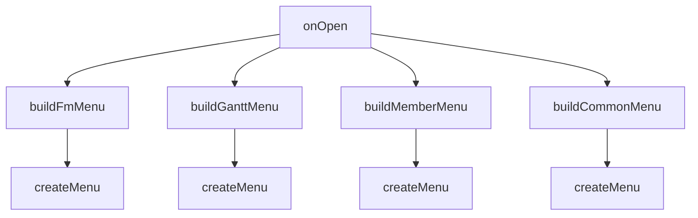

- **3100_controller_popupDialog.js**: カスタムポップアップダイアログの制御
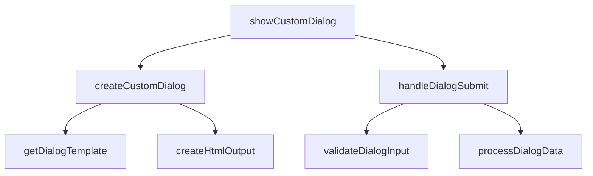

- **3101_view_CustomPopupTemplate.html**: ポップアップダイアログのHTMLテンプレート
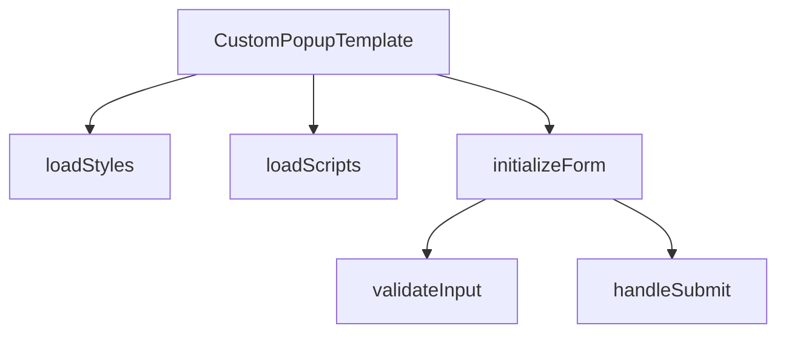

#### Service Layer (2000番台)
- **2000_service_memberDataUpdater.js**: メンバー情報の更新処理
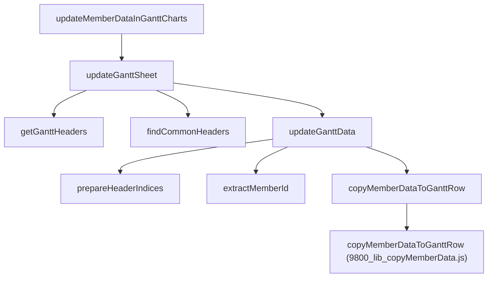

- **2100_service_shiftDataMerger.js**: シフトデータの統合処理
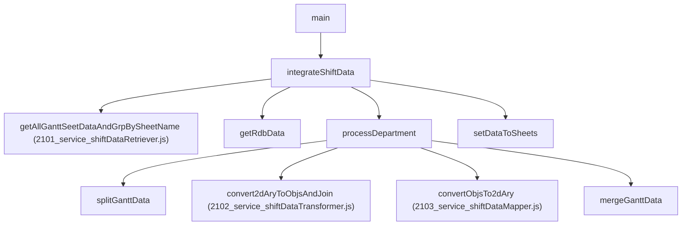

- **2101_service_shiftDataRetriever.js**: シフトデータの取得
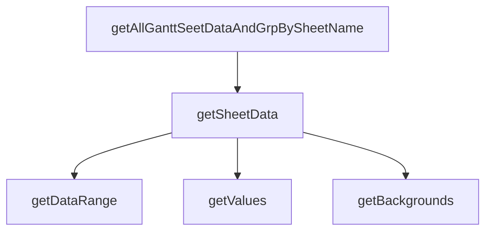

- **2102_service_shiftDataTransformer.js**: シフトデータの変換処理
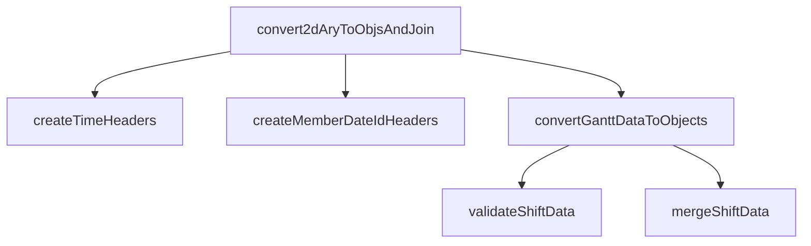

- **2103_service_shiftDataMapper.js**: シフトデータのマッピング処理
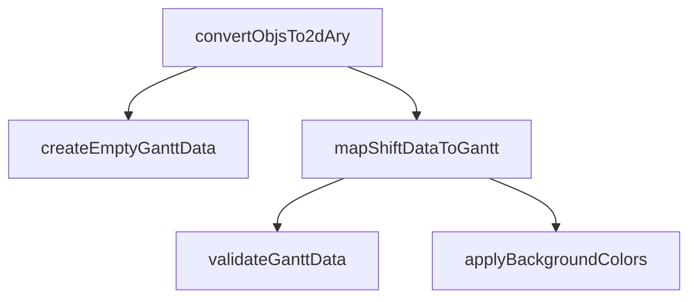

- **2199_service_columnManager.js**: 列管理とヘッダー処理
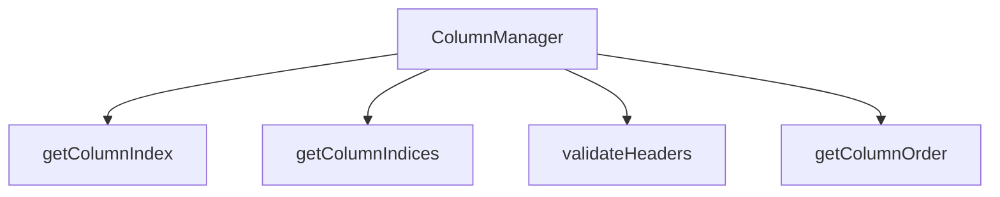

#### Template Layer (1000番台)
- **1000_template_ganttBuilder.js**: ガントチャートテンプレートの構築
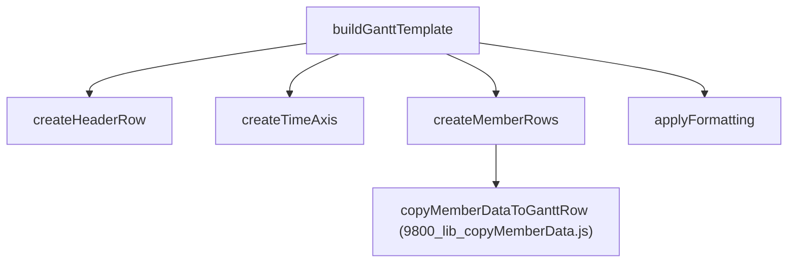

- **1100_template_ganttCloneWithMemberData.js**: メンバーデータ付きガントチャート複製
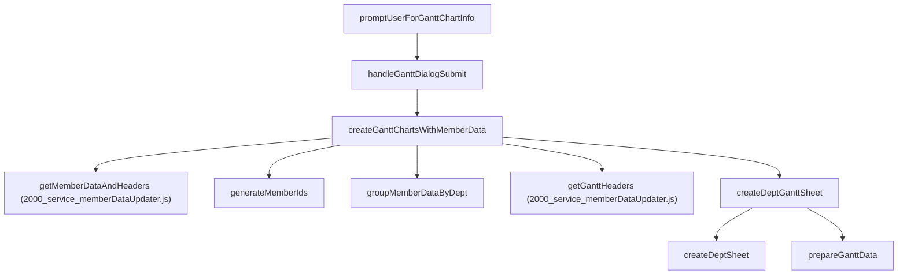

#### Library Layer (9000番台)
- **9800_lib_copyMemberData.js**: メンバーデータコピー処理のライブラリ
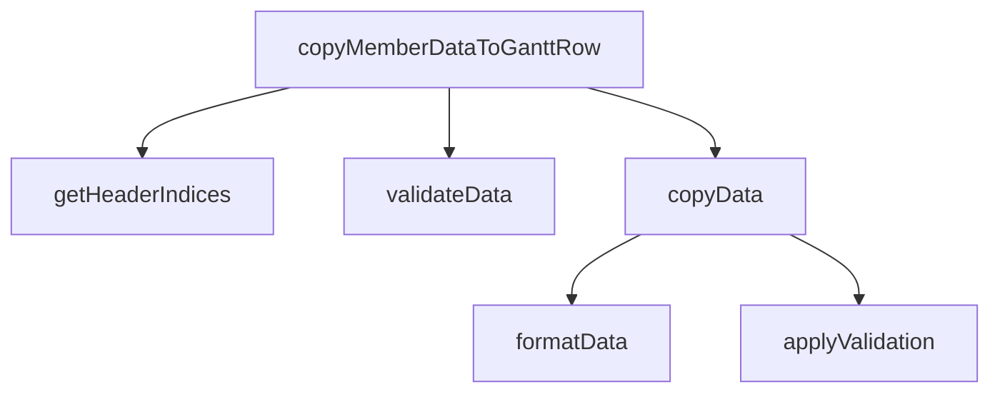

- **9900_lib_cellMerger.js**: セル結合処理のライブラリ
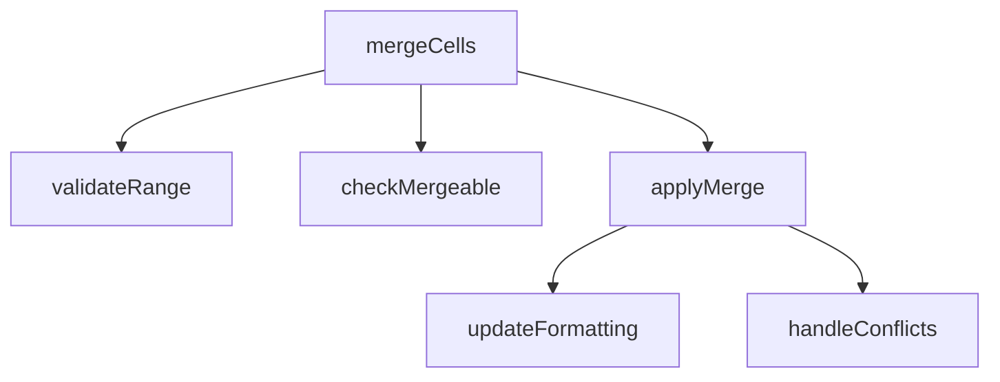

#### 設定ファイル
- **.clasp.json**: Google Apps Script CLI設定
- **appsscript.json**: GASプロジェクト設定
- **.gitignore**: Git除外設定
- **README.md**: プロジェクト概要

### 設定値・定数管理

#### スクリプトプロパティ
```javascript
const SCRIPT_PROPERTIES = {
  GANTT_SS: "対象ガントチャートスプレッドシートURL",
  HEADER_RANGE_A1: "ヘッダー範囲のA1記法"
};
```

#### 共通定数
```javascript
const COL_HEADER_NAMES = {
  DEPT: "dept",
  EMAIL: "email", 
  MEMBER_ID: "memberId",
  MEMBER_DATE_ID: "memberDateId",
  DATE: "date"
};

const MEMBER_DATA_SHEET_NAME = "メンバー情報";
const GANTT_TEMPLATE_SHEET_NAME = "GCテンプレ";
```

### 開発環境・ツール

#### 開発環境セットアップ
```json
// .clasp.json
{
  "scriptId": "YOUR_SCRIPT_ID",
  "rootDir": "./",
  "projectId": "YOUR_PROJECT_ID"
}
```

#### 必要なツール
- **clasp**: Google Apps Script CLI
- **Git**: バージョン管理
- **VS Code**: 推奨エディタ

#### 開発フロー
1. ローカル開発環境でコード編集
2. `clasp push` でGASプロジェクトにデプロイ
3. GASエディタでテスト実行
4. Gitでバージョン管理

### デプロイメント手順
```bash
# 1. ローカルでの開発
git clone [repository]
cd shift-automation

# 2. claspでログイン
clasp login

# 3. プロジェクトの設定
clasp create --type standalone

# 4. デプロイ
clasp push

# 5. バージョン管理
git add .
git commit -m "機能追加: XXX"
git push origin main
```